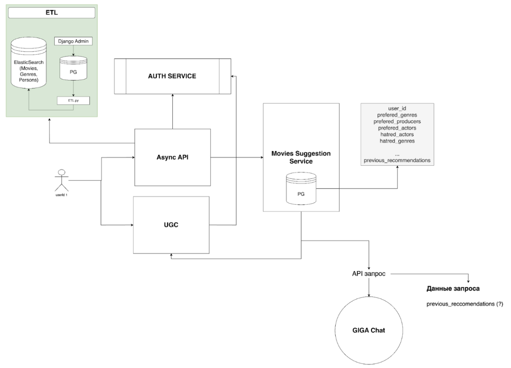

# Кинотеатр

Рекомендательный сервис. 
Конечный продукт [бизнес-требование] – сервис, рекомендующий фильмы, на основе лайков пользователей.

## Архитектура системы 

Сначала нужно зарегистрироваться, залогиниться и получить access token
Можно зайти на главную страницу, то есть посмотреть рекомендации (Async API Service)
поставить лайк или дизлайк и нажать “рекомендовать подобное”, “исключить из рекомендаций”. 

При этом наши сервисы идут в Auth Service, проверить права пользователя и соотнести конкретного пользователя с его конкретными рекомендациями. 

При постановке лайка или дизлайка работает наш сервис UGC. 

Сервис рекомендаций идет в UGC, просматривает поставленные лайки, дизлайки, то, что пользователь не хочет видеть в рекомендациях и пр. и, потом идет к GigaChat, запрашивает новые рекомендации. 
Но, так как это дорогая операция, будем делать ее с некоторой периодичностью (раз в час, раз в сутки). 

Внутри сервиса рекомендаций лежит база данных, с рекомендованными фильмами. 

Сервис рекомендаций идет в наш ElasticSearch, сопоставляет с тем, какие фильмы есть у нас и выдает ответ пользователю. 

## Контейнеры

Сейчас у нас поднимается через local_run.sh 14 контейнеров (1 тестовый не в счет). 
Их зона ответственности:
* etl_transporter - переносит данные из sqllite в PG
* etl_db - Postgres база для фильмов
* etl - ETL pipeline
* etl_es - ElasticSearch со всеми фильмами
* auth_service - сервис авторизации
* postgres_auth - БД для сервиса авторизации
* redis_async_api - Redis для сервиса AsyncAPI, который отдает пользователям данные
* async_api_service - сам сервис AsyncAPI
* postgres_recommendation - наш рекомендательный сервис с ручкой, которая возвращает рекомендованные пользователю фильмы
* scheduler - скрипт, работающий в бесконечном цикле, который ходит в ГигаЧат и кладет результат в базу рекомендательного сервиса
* nginx
* like_service - Сервис лайков (UGC)
* mongodb - NoSQL база для сервиса лайков

## Шедулер

В данный момент внутри контейнера scheduler в бесконечном цикле крутится скрипт fetch_recommendations.py,

Этот скрипт делает 4 запроса
1. в ugc, забирает лайки у всех пользователей
2. отправляет запрос в async_api, чтобы по uuid получить название фильмов (ручка для этого есть ASYNC_API_URL_TITLE_BY_UUIDS)
3. с этими данными идет в гигачат, получает рекомендации
4. записывает результат в БД сервиса RegSys
5. нужно будет написать ручку в async_api, чтобы она выгружала данные из БД RecSys. Если данных нет, то отдает по imdb (как сейчас и есть)

Мы осознаем все проблемы этого решения, так как и запросы в гигачат довольно долгие и этих запросов очень много. 
Изначально мы хотели написать реализацию через сервис очередей (Kafka) и даже почти сделали это, но, к сожалению, немного не хватило скиллов и опыта, чтобы все поднять.. 

Поэтому остановились на такой неоптимальной, но на этапе MVP возможной реализации. 

## Проблемы и улучшения

Конечно, мы понимаем все минусы нашего подхода, но мы сделали все, что смогли.. 
Сейчас у нас захардкожен user_id при обращении ко всем ручкам. К сожалению, мы не знаем, как из декоратора auth_validator внутри эндпойнта достать user_id. Возможно, что можно через request.state модуля Request из FastAPI. 
Как было сказано выше, вместо контейнера scheduler нужно использовать систему очередей. 

